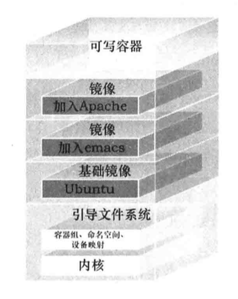

[TOC]

镜像是docker 用来启动容器的构建基石，那么什么是镜像呢？

# Docker 镜像

> 什么是镜像

Docker 是由文件系统叠加而成.



最低端是一个引导文件系统：bootfs，这很像典型的Linux/Unix的引导文件系统。Docker用户几乎永远不会和引导文件系统有什么交互，实际上，当一个容器被加载进内存，启动后，引导文件会被卸载。以留出更多的内存供initrd磁盘镜像使用。

Dcoekr 很像一个典型的Linux虚拟化栈，docker镜像的第二层是root文件系统rootfs，它位于引导文件系统之上，rootfs可以是一种或者多种操作系统(如Debian或者readhat)

在传统的Linux引导过程中，root文件系统会最先以只读的方式加载，当引导结束并完成了安全性检查，它才会被切换为读写模式。但是在docker里，root文件系统永远只能是只读状态，，并且Docker利用联合加载（union mount）技术。又会在root文件系统之上加载更多的只读文件系统。联合加载是指一次同时加载多个文件系统。但是外面只能看见一个文件系统。联合加载会将各层文件系统叠加在一起，这样最终的文件系统会包含所有底层的文件系统和目录。

   Dcoekr将这样的文件系统称为镜像。一个镜像可以放到另一个镜像的顶部。位于下面的镜像称为父镜像，以此类推，最底层的镜像称为基础镜像。最后，当从一个镜像启动容器时，Dcoker会在该镜像最顶层加载一个读写文件系统。我们想要在docker中运行的程序就是在这个读写层中执行的。

   当Docker第一次启动一个容器时，初始的读写层是空的。当文件系统发生变化时，这些变化都会应用到这一层上。比如想要修改一个文件，这个文件会从只读层复制到该读写层。这种机制被称为写时复制（copy on write）


## 列出本地镜像

> sudo docker images

该命令会列出本地所有的dcoker镜像，这些镜像就是执行docker run指令时，从docker官方上下载的。
- 在linux上

本地的镜像存放在/var/lib/docker目录下。每个镜像都保存在docker所采用的存储驱动目录下面，如aufs或者devicemapper。
容器保存在/var/lib/docker/containers目录下看到所有的容器。

- 在 Mac 上(Docker for Mac 版本)

镜像:~/Library/Containers/com.docker.docker/Data/com.docker.driver.amd64-linux/Docker.raw
容器:

   镜像从仓库中下载下来，默认的仓库是docker公司运营的公共Registry服务。及Docker Hub。也可以自己建立Registry仓库。


每个仓库都可以存放很多镜像，比如ubuntu仓库，
## 下拉仓库

> sudo docker pull ubuntu

同一类型的镜像放在同一个仓库中，例如ubuntu的镜像放在ubuntu仓库总。如上指令拉取ubuntu中的所有镜像。使用docke images就可以查看所有下拉下来的镜像。统一仓库中不同镜像使用tag进行了区分。

**虽然称其为ubuntu系统，但实际上并不是一个完整的系统。只是一个包换最低限度的支持系统运行的组件。**

同一个仓库中的不认同镜像可以使用tag区分。想要指定某个仓库中的特殊镜像时，就是用用<仓库名:tag>来表示的。

> sudo docker run -it --name new_container ubuntu:12.04 bash

如果没有指定标签，则会默认拉取标记为latest的镜像。

每个镜像可以打几个不同的tag，每个tag实际上是对组成镜像的一个镜像层的标记。例如不通基于ubuntu的镜像都可以打上ubuntu的tag。


docker Hub 包含两种仓库，用于仓库和顶级仓库。顶级仓库是由Docker内部管理的。用户仓库的命名由<用户名/仓库名>两部分组成。而顶级仓库只包含仓库名，如ubuntu。


## 查看本机镜像

> docker images [仓库名/镜像名]
docker images fedora

如果不指定仓库名，将显示所有的本地镜像。
所列出的镜像中，相同id号的镜像是同一镜像，只是tag不同。

## 查找Docker Hub上的镜像

> docker search [镜像名[:tag]]
镜像名和tag可以任意组合，来查找在线仓库中的镜像。
查找到之后就可以使用镜像名下载或者创建本机镜像。docker会自动从Dcoker Hub上下载并创建本地镜像。

## 构建镜像
并不是真的从零创建一个新的镜像，而是使用一个已有的基础镜像，如ubuntu构建。如果想要从零构建一个全新的镜像，可以参考:https://docs.docker.com/articles/baseeimages/

构建docker镜像有两种方法
- docker commit 命名
- docker build命令和Dcokerfile文件

不推荐使用docker commit命名，而应该使用更灵活、更强大的dockerfile来构建docker镜像。


### commit创建镜像
一般步骤是:
1. docker run 基于已有的镜像创建一个容器。
2. 运行容器，在容器中安装需要的软件和服务。例如ubuntu使用apt命名安装软件。
3. 退出容器。docker commit 执行变更。就像是对git仓库提交一样，将修改提交为一个新镜像。

> sudo docker commit <容器名|ID[:标签名]> <目标仓库/镜像名> [-m="说明" --author="作者"]

- ID，可以通过 docker ps -l -q 得到刚创建的容器的id。
    - -l: --latest
    - -q: --quiet: Only display numeric IDs.
目标仓库: 创建的镜像要保存的仓库
镜像名: 保存的镜像的名字。

提交和git一样，只会保存创建的容器和当前容器之间的差异。

可以使用 docker inspect 命令查看新创阿金的镜像的信息信息
$ sudo  docker inspect 仓库名/镜像名:标签名

[docker commit 的所有选项](https://docs.docker.com/references/commandline)


### Dockerfile 构建镜像

Dockerfile使用基于 DSL 的语法来构架一个 Docker 镜像，使用docker build命令来执行Dcokerfile中的指令构建一个新的镜像。


首先创建一个文件夹，然后在其中创建一个 Dockerfile 文件，这个目录就是我们的构建环境（build environment），Docker 称其为上下文（context）或者构建上线文。Docker 会在构建环境时将构建上下文和改上下文中的文件和目录上传到 Docker 守护进程。这样 Docker 守护进程就能直接访问你想要在金乡中存储的任何代码、文件或者其他数据。

最简单的 Dockerfile
Dockerfile 由一些指令和其参数构成，每个指令都必须大写，后跟其参数。
```
# 注释
FROM ubuntu:18.04 # 指定基础镜像，后继指令会基于该镜像。
MAINTAINER James Turnbull "james@example.com" # 指定镜像的作者和练习方式，方便发布后，其他人练习作者。
RUN apt-get update # 要在基础镜像后进行的修改。每个 RUN 指令都会创建一个镜像层。
RUN apt-get install -y nginx
RUN echo 'Hi, I am in your container' \
    > /user/share/nginx/html/index.html
EXPORT 80 # 告诉 Docker 改容器内的应用将会使用容器的端口。这并不意味着容器的该端口就是可以访问的，处于安全性的考虑，Docker 并不会自动打开该端口，而是需要再使用 docker run 指令运行容器时使用 -p 指定需要打开哪些端口。


```

- Dockerfile 中的指令按照从上到下的顺序执行，所以应该根据需要合理安排指令的顺序。
- 每条指令都会创建一个新的镜像层，并对镜像进行提交。Docker 大体上按照如下的流程执行 Dockerfile 中的指令

1. Docker从基础镜像上运行一个容器。
2. 执行一条指令，对容器做出修改
3. 执行类似 docker commit 的操作，提交一个新的镜像层
4. Docker 再基于上提交的镜像运行一个新容器。
5. 执行 Dockerfile 中的下一条指令，知道所有的指令都执行完毕。


默认情况下，RUN 指令会在 shll 里使用命令包装器 /bin/sh -c 来执行。 如果是在一个不支持 shell 的平台上运行或者不希望在 shell 中运行（比如避免 shell 字符串篡改），可以使用 exec 格式的 RUN 指令。

RUN ["apt-get", "install", "-y", "nginx"]

#### 基于 Dockerfile 构建镜像

执行 docker build 时，Docker会在指定的目录下寻找 Dockerfile 文件， Dockerfile 中的所有指令都会被执行并且提交，并且在改命令成功结束后，返回一个新镜像。并输出改镜像的 id。

$ sudo docker build -t="指定创建后的镜像的目标仓库/镜像名[:tag]" .

- 如果没有为镜像指定标签，Docker 会自动为镜像设置一个 lastest 标签。

- "." 告诉 Docker 到本地目录中去找 Dockerfile 文件。也可以指定一个git 仓库源地址来指定 Dockerfile 的位置
```
$ sudo docker build -t="指定创建后的镜像的目标仓库/镜像名[:tag]" \
git@github.com:.../
```
Docker 会假定git 仓库的目录中存在 Dockerfile 文件。

> 忽略文件，不需要上传到 镜像中的文件

在构建上下文的根目录（Dockerfile 所在的位置）存在以 .dockerignore 命名的文件，该文件和文件中指定的文件都不会上传到镜像中。该文件使用了 Go 语言中的 filepath.

#### 查看镜像的构建过程
```
$ sudo docker history <docker-id>
```

#### 指令执行失败

根据 Dockfile 的执行机制，每条RUN 指令都是一个提交，所有如果某一条指令执行失败了，那么也会得到一个可以使用的镜像，这对调试非常有帮助，可以基于该镜像运行一个具备交互更能的容器，使用最后创建的镜像对执行失败的命令进行调试。


sudo docker run 最后一条成功指令输出的id

#### 构建缓存

docker 对镜像进行构建是，每执行一条语句都会进行一次提交，再次执行构建时，它会将之前已经构建成功的当做缓存，在其基础之上构建，而不是从新开始构建。这是非常明智的做法，能够节省很多时间。但有是有你希望从新构建，而不是使用缓存，这时需要再构建时使用 --no-cache 标志

$ sudo docker build --no-chche -t="指定创建后的镜像的目标仓库/镜像名[:tag]" .


如果想要只对某一部分后需要更新的内容不使用缓存，可以有一个变通的方法，那就是使用 ENV 来设置一个变量，从新构建是，修改该变量即可。

```
FROM ubuntu:18.04
MAINTAINER James Turnbull "james@example.com"
ENV REFRESHED_AT 2018-06-13
RUN apt-get -qq update # 要在基础镜像后进行的修改。每个 RUN 指令都会创建一个镜像层。
RUN apt-get install -y nginx
...

```

在 apt-get update 之前，使用 ENV 设置了一个换名变量。在下次需要变更镜像时，只需要修改 REFRESHED_AT 的值，由于这条命令被更改了，再次构建时，将从这条指令开始执行，之后的 apt-get 也会跟着执行，保证了应用最新的软件包，而不是原先构建的缓存。


#### 查看镜像是如何构建的

sudo docker history <image_name|id>

#### docker run 从镜像启动容器

跟下载的镜像启动没有什么区别。查看 [docker run](./start.md)


## Dockerfile 指令

### RUN

### EXPOSE

### CMD 容器启动时运行的命令

RUN 命令指定镜像被构建时运行的命令，而 CMD 指定容器被启动时要运行的命令。这和使用 docker run 命令启动容器时指定要运行的命令非常类似。

sudo docker run -it ubuntu bash

和如下 Dockerfile 的写法一样

CMD ['/bin/true']

当然也可以为需要的命令指定参数

CMD ['/bin/bash', '-l']

> 需要注意的是，要运行的命令时存放在一个数组结构中的。这将告诉 Docker 按指定的原样来运行该命令。当然，也可以不使用数据指定 CMD 命令，这时候 Docker 会在指定的命令前加上 `/bin/sh -c`。这在执行该命令的时候，可能导致一些意料之外的行为，所以 Docker 推荐一只使用以数组语法设置哟啊执行的命令。

docker 命令会覆盖 CMD 命令，如果两处都指定了，则会执行 docker run 指定的。


### ENTRYPOINT

ENTRYPOINT 指令也是指定容器启动时执行的命令，但是 ENTRYPOINT 指定的命名不会被 `docker run` 启动容器的参数覆盖，实际上，docker run 命令行中指定的任何参数都会被当做参数再次传递给 ENTRYPOINT 指令中指定的命令。
例如：
```
ENTRYPOINT ["/usr/sbin/nginx"]
```

类似于 CMD 指令，我们也可以在该指令中通过数组的方式为命令指定相应的参数，
```
ENTRYPOINT (["/usr/sbin/nginx", "-g", "daemon off; "]
```

修改后构建镜像
```
sudo docker build -t="jamtur01/static_ web".
```

然后，我们从jamtur01/static_ web 镜像启动一个新容器
```
sudo docker run -t -i jamtur01/static_ web -g "daemon off; "
```

从上面可以看到，我们重新构建了镜像，并且启动了一个交互的容器。我们指定了-g "daemon off;“参数，这个参数会传递给用 ENTRYPOINT 指定的命令，在这里该命令为 /usr/sbin/nginx -g "daemon off;"。该命令会以前台运行的方式启动 Nginx 守护进程，此时这个容器就会作为一台 Web 服务器来运行。

我们也可以组合使用 ENTRYPOINT 和 CMD 指令来完成一-些巧妙的工作。比如，我们可能想在 Dockerfile 里指定代同时使用 ENTRYPOINT 和 CMD指令
```
ENTRYPOINT ["/usx/sbin/nginx"]

CMD  ["-h"]
```

此时当我们启动一个容器时，任何在命令行中指定的参数都会被传递给 Nginx 守护进程。比如，我们可以指定-g "daemon off“；参数让 Nginx 守护进程以前台方式运行。如果在启动容器时不指定任何参数，则在 CMD 指令中指定的-h参数会被传递给 Nginx守护进程，即Nginx服务器会以/usr/sbin/nginx -h 的方式启动，该命令用来显示 Nginx 的帮助信息。

这使我们可以构建一个镜像，该镜像既可以运行一个默认的命令，同时它也支持通过 dockerrun 命令行为该命令指定可覆盖的选项或者标志。


> 如果确实需要，你也可以在运行时通过 docker run 的--entrypoint 标志覆盖 ENTRYPOINT 指令。

### WORKDIDR

### ADD

### COPY

### VOLUME


### USER

### ONBUILD

### ENV
